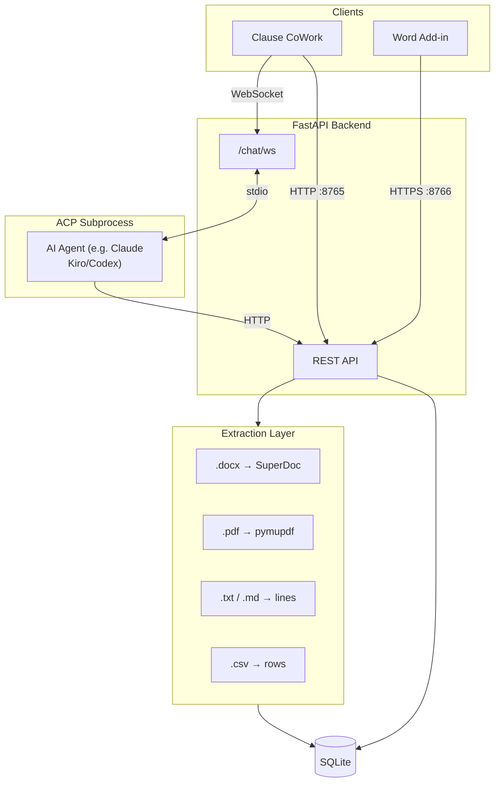

# Architecture

## System overview

Clause CoWork is a locally-running system for AI-assisted legal document analysis. It has two apps and a shared Python backend. No document data leaves your machine except LLM enrichment calls to your configured provider.



**Clause CoWork** is the primary app. The AI agent (Claude Code, Kiro, or any ACP-compatible agent) runs document discovery, extracts text blocks from supported files, classifies clauses, and stores results to SQLite. The chat panel drives the agent via ACP (Agent Client Protocol) over WebSocket.

**The add-in** is a read-only viewer. It loads what the agent has already written and syncs with the Word cursor. Settings, parsing, and enrichment all live in Clause CoWork — not the add-in. The add-in has its own backend port (8766, HTTPS) because Office JS task panes require HTTPS.

---

## Monorepo Structure

```
word-graph-mode/
  package.json              # npm workspaces root
  tsconfig.base.json        # shared TypeScript compiler options
  packages/
    shared/                 # @word-graph/shared — shared product UI and API client
      src/
        api.ts              # shared backend API client (axios, no Office dependency)
        components/
          WordGraphPanel/   # graph canvas, theme, fonts, ThemeContext, filter/node/connection components
        ContractMap/        # ContractMap, ClauseDetails, TilesView
        settings/           # NodeTypesSection, ConnectionThresholdSection
  addin/                    # Word add-in shell (Office JS specific only)
  clause-cowork/            # Electron/web app shell
  backend/                  # FastAPI backend (Python)
  skills/                   # Agent skills deployed into workspaces by the skill installer
    shared/scripts/         # Scripts merged into every skill (get_docs, set_doc_classification, set_clause_classification, add_to_pool, …)
    index/                  # /index skill — workspace.md + per-doc wiki notes
    analyse/                # /analyse skill — parse, classify, connections
```

**Import rule:** `addin` and `clause-cowork` never import from each other. Both import shared product code from `@word-graph/shared`. Each app only contains code specific to its runtime (Office JS for addin, Electron/browser for clause-cowork).

---

## Document support

**Parsing (node extraction): `.docx`, `.pdf`, `.txt`, `.md`, `.csv`.**

All five types are extracted into clause nodes and stored in SQLite. The extraction strategy differs per type:

| Extension | Extractor | Node granularity |
|---|---|---|
| `.docx` | SuperDoc SDK (`AsyncSuperDocClient`) | Paragraph blocks with stable `nodeId` |
| `.pdf` | pymupdf (`fitz`) | Text lines per page block |
| `.txt` / `.md` | Line split | One node per non-empty line |
| `.csv` | `csv.reader` | One node per row, rendered as a pipe-table |

The LLM agent classifies the extracted text — it never reads the raw file. Non-extractable files (e.g. `.xlsx`) are tracked in the workspace DB as stubs (no nodes) and shown in the file explorer but cannot be classified.

---

## Document Identity

Each document is assigned a **UUID** (`doc_id`) when first registered. This UUID never changes regardless of file moves, renames, or copies.

`workspace.py` runs a **reconciliation loop** on every `/workspace/folder-tree` call:

| Event | Detection | Action |
|---|---|---|
| New file | Path not in DB | Register new UUID stub; fire background extraction for extractable types |
| Modified | `file_mtime` changed + content hash differs | Update `content_hash`, trigger async background extraction |
| Moved/renamed | Old path gone, content hash matches live row | Update path only, same UUID |
| Copied | Content hash matches existing doc, original still exists | New UUID, clone nodes from original |
| Deleted | Path no longer on disk | Tombstone doc + nodes; set `broken_at` on `document_links` (real docs with `content_hash` only) |
| Restored unchanged | Path reappears with same content hash | Un-tombstone, same UUID; clear `broken_at` on its document_links |
| Restored modified | Path reappears with different content hash | New UUID |
| Never extracted | `last_extracted_at IS NULL` on known path | Fire background extraction (e.g. backend restarted before task completed) |

**`content_hash`**: SHA-256 of full file content (chunked). Used for move/copy detection.
**`path_hash`**: SHA-256 of absolute path (indexed column for fast lookups — not the doc's primary key).
**`tombstoned`**: soft delete — rows are never physically deleted.

`doc_id` resolution for all routes goes through `services.db.get_or_register_doc_id(path, db_path)` — a DB path lookup, never a path hash.

---

## Backend

### Entry point

`backend/main.py` — FastAPI app, CORS middleware (`allow_origins=["*"]` is intentional: the server binds to 127.0.0.1 only), mounts all routers. Lifespan handler cancels in-flight background extraction tasks and shuts down ACP sessions on exit.

### Routers

| Router | Prefix | Purpose |
|---|---|---|
| `health.py` | `/health` | Liveness check |
| `parse.py` | `/parse` | Explicit parse: extract → reconcile → upsert → return graph |
| `clauses.py` | `/clauses` | DB read (GET), user edits to clause type, tags, visibility; bulk actions |
| `connections.py` | `/connections` | User-created and user-rejected clause-level connections |
| `config.py` | `/config` | Workspace settings (tag pool vocabulary, strict flags, re-enrich threshold). Accepts `workspace_path` query param. |
| `tags.py` | `/tags` | Tag pool CRUD and CSV import/export. `PATCH` and `DELETE` accept the tag name in the JSON request body to avoid routing issues with tags containing `/`. |
| `chat_ws.py` | `/chat` | ACP WebSocket bridge (`/chat/ws`), session management REST endpoints, skill installer endpoint |
| `workspace.py` | `/workspace` | Folder tree + DB reconciliation, file serve, workspace stats |
| `document_meta.py` | `/document-meta` | `doc_tags`, notes, `document_links` CRUD. `GET /document-meta/links/all` returns all workspace links for WorkspaceGraph. **Note:** `/links/all` must be declared before `/links/{link_id}` in FastAPI to avoid routing conflict. |
| `fs.py` | `/fs` | Filesystem browser for folder picker (`GET /fs/ls`) |

### Parse pipeline

`POST /parse`:

```
file path (any supported type)
    │
    ▼ services/extractor.py  extract_blocks()
    ├── .docx → AsyncSuperDocClient.extract()   →  list[ExtractedBlock] (stable nodeId)
    ├── .pdf  → fitz page blocks                →  list[ExtractedBlock] (synthetic id)
    ├── .txt/.md → line split                   →  list[ExtractedBlock] (synthetic id)
    └── .csv  → csv.reader rows                 →  list[ExtractedBlock] (synthetic id)
    │
    ▼ services/hasher.py  hash_paragraph()
    SHA-256 fingerprint (16 chars, normalised whitespace) per block
    │
    ▼ services/clause_reconciler.py  reconcile_blocks()
    ├── stable_id hit  → update position/hash/text; set needs_reclassification if content changed
    ├── stable_id miss, fuzzy match → migrate stable_id to new nodeId, preserve type/tags
    └── stable_id miss, no match   → create new Node
    │
    ▼ services/db.py  upsert_node() × N
    SQLite write — preserves user tags + type (COALESCE; force_type=True for explicit clears)
    │
    ▼ tombstone_missing_nodes()
    Mark nodes not present in current parse as tombstoned=1
    │
    ▼
GraphResponse(doc_id, nodes, new_paragraph_count, tombstoned_count)
```

**Background extraction** (`_extract_and_update_nodes` in `workspace.py`) runs the same pipeline asynchronously whenever the reconciliation loop detects a new or changed file. It never blocks the folder-tree response. Disabled in tests via `TESTING=1` env var (set in `conftest.py`).

### Paragraph identity

Each paragraph gets a **stable identity** that survives across re-parses:

- **`stable_id`**: SuperDoc's `nodeId` for `.docx`; synthetic `{prefix}-{index}` for other formats. Stable across re-parses of the same document.
- **`paragraph_hash`**: SHA-256 of whitespace-normalised text, truncated to 16 hex chars. Detects content changes.
- **`needs_reclassification`**: set `True` only when a node that already has a `type` is re-extracted with changed content. Never set on unclassified nodes.
- **Tombstone**: Nodes missing from the current parse are marked `tombstoned=1` and excluded from graph responses.

### SQLite schema

One database per workspace, stored at `.clause-cowork/db/workspace.db`:

```sql
documents   -- id (UUID), path,
               last_analysed_at (when agent last classified, derived from MAX(clauses.updated_at)),
               last_extracted_at (when background extraction last ran),
               file_mtime, content_hash, path_hash, tombstoned,
               doc_tags (JSON array), notes

clauses     -- (stable_id, doc_id) composite PK, paragraph_hash, position,
               raw_text, clause_type, is_table, tombstoned, parent,
               needs_reclassification, updated_at

tags        -- id, stable_id, doc_id, value, user_defined
               UNIQUE(stable_id, doc_id, value)

connections -- id, source_id, source_doc_id, target_id, target_doc_id,
               edge_type, note, user_created, user_rejected

document_links -- id, source_doc_id, target_doc_id, relationship ('references'),
                  note, created_by, created_at,
                  broken_at (set on tombstone, cleared on restore)

config      -- key, value  (JSON blob, key='workspace')

tag_pool    -- tag (PK), description, source, created_at,
               kind ('clause_type' | 'clause_tag' | 'doc_type' | 'doc_tag')

_migrations -- name (PK)  — tracks which one-shot migrations have run
```

**Schema changes go in `backend/db/schema.sql` only.** There are no live production DBs — the only DB is `test-data/.clause-cowork/db/workspace.db`, which can be patched manually or recreated. `migrations.py` exists solely to patch two legacy columns (`tags.doc_id`, `connections.doc_id`) and the `document_links.broken_at` column that predate this rule. **Do not add new ALTER TABLE entries to `migrations.py`.**

**User data preservation rules:**
- `upsert_node` uses `COALESCE(excluded.clause_type, clause_type)` — the agent can never silently overwrite a user-set type.
- `upsert_node(force_type=True)` bypasses COALESCE — used only for explicit "Clear Clause Type" bulk actions.
- AI-suggested tags (`user_defined=0`) are replaced on re-parse; user-defined tags (`user_defined=1`) are never touched by the agent.

### Models

`backend/models/clause.py`:
- `Clause` — the graph node (one paragraph or table)
- `Connection` — directed clause-level edge between clauses
- `Tag` — topic label (AI-suggested or user-defined)
- `EdgeType` — one of: `references`, `subject_to`, `contradicts`

`backend/models/config.py`:
- `WorkspaceConfig` — strict flags (`strict_clause_types`, `strict_clause_tags`, `strict_doc_types`, `strict_doc_tags`), `re_enrich_threshold` (fuzzy match score below which reclassification is triggered, default 0.85), and connection guidance text. Vocabulary (clause types, clause tags, doc types, doc tags) lives in the `tag_pool` table, not in this config.

### Tag pool

The `tag_pool` table is a user-curated **vocabulary** of reusable label names, distinct from the `tags` table (per-node applied labels). Four kinds: `clause_type` (the type taxonomy for classifying clause nodes), `clause_tag` (topic labels applied to clause nodes), `doc_type` (whole-document classification), `doc_tag` (document-level topic labels). The agent script `get_workspace_config.py --level clause|doc` reads these pools as the classification vocabulary before each analysis run.

`backend/services/tag_pool.py` manages CRUD and CSV import/export. `normalize_tag()` strips control characters, null bytes, collapses whitespace, and enforces a 64-character max — applied at all write paths (tag pool, doc_tags, agent scripts). PATCH and DELETE accept the tag name in the JSON request body (not the URL path) to avoid routing issues with tags containing `/`.

---

## ACP Agent Bridge

`backend/routers/chat_ws.py` + `backend/services/acp_session.py`

The chat panel connects via WebSocket to `/chat/ws`. The backend bridges to an ACP (Agent Client Protocol) subprocess — Claude Code (`npx @agentclientprotocol/claude-agent-acp`), Kiro (`kiro-cli acp`), or any ACP-compatible agent.

**Session lifecycle:**
- First WS connection for a workspace → spawn ACP process, run `initialize` + `session/new` (or `session/load` to resume)
- Subsequent connections → reuse existing session
- Idle for 30 min with no active WS → process killed by reaper
- Agent sessions are persisted per workspace in `.clause-cowork/acp-session.json` keyed by `acp_bin` string — switching agents never clobbers session history

**`session/cancel` is a notification** (no `id` field). Sending it as a JSON-RPC request (with `id`) causes Kiro to reject it with `-32601 Method not found`.

**Error surfacing:** Unsolicited JSON-RPC errors from the agent are forwarded to WS clients as `{"type": "error", "message": "..."}` rather than dropped silently.

---

## Agent Skills

Skills are plain markdown + Python scripts deployed into the workspace at `.claude/skills/<skill-name>/` by `POST /chat/install-skills` (which calls `backend/services/skill_installer.py`). The installer merges `skills/shared/scripts/` into every skill's `scripts/` folder.

| Skill | Purpose |
|---|---|
| `/index` | Read and summarise all documents; maintain `notes/workspace.md` and per-doc wiki notes at `notes/wiki/<filename>.md`; append `indexed` entries to `notes/log.md`. Detects explicit cross-document references and calls `set_document_link.py`. Never classifies. |
| `/analyse` | Parse supported files, classify clauses and documents, assign types/tags/sections, record cross-clause and cross-document connections. Reads notes from `/index` as context. The agent calls `get_workspace_config.py` for vocabulary, parses any new/modified files, classifies clauses via `set_clause_classification.py`, and updates `notes/workspace.md` with graph stats. Can be targeted at a single document or run across the whole workspace. |

Skills are invoked by the agent via slash commands in the chat panel. The agent runs them from the workspace root; scripts are at `.claude/skills/<skill>/scripts/`.

### Design inspiration

The `/index` skill is inspired by Andrej Karpathy's [LLM-as-wiki pattern](https://gist.github.com/karpathy/442a6bf555914893e9891c11519de94f) — the agent reads documents and maintains a living `notes/workspace.md` knowledge base that accumulates context across sessions, rather than re-reading everything on each run.

### Limitations

- **Skills require tuning per domain.** The default clause type vocabulary in the tag pool and classification prompts in `/analyse` are written for legal contracts. Different document types (technical specs, financial reports, etc.) will need the vocabulary adjusted via the Tag Pool UI and skill files.
- **Skills are prompt-based.** Quality of extraction and classification depends on the underlying model and prompt. Results should be independently verified.
- **No skill versioning.** When skills are reinstalled, they overwrite the workspace copy. Any local edits to `.claude/skills/` will be lost on reinstall.

---

## Clause CoWork App

`clause-cowork/src/`

- **`App.tsx`** — root layout: file explorer, doc view (graph/list/info tabs), chat panel. Icon rail controls three mutually-exclusive panel modes: File Browser, Workspace Graph, Tag Pool.
- **`components/WorkspaceGraph/WorkspaceGraph.tsx`** — D3 force-layout graph of all workspace documents. Three node kinds: `workspace` (central hub), `doc` (document), `tag` (document type — one per unique `doc_type` value). Three link kinds: `hub` (workspace→doc), `tag-member` (doc_type→doc), `doc-link` (doc↔doc from `document_links`). Workspace hub and doc nodes share the same colour (`theme.nodeColour`); doc_type nodes use a dashed circle (`theme.taupe`). Only `doc_type` appears as a tag node — `doc_tags` are not rendered in the graph. Doc-link edges highlight on hover (hovered edge + both endpoint nodes brighten; others dim). Doc links only use `relationship='references'` — `subject_to` and `contradicts` are clause-level only and do not appear in the workspace graph.
- **`components/DocView/DocView.tsx`** — tab host: Info (all file types), Detail (extractable files only)
- **`components/DocView/InfoTab.tsx`** — file metadata, `doc_tags`, `document_links`, notes.
- **`components/PreviewPanel/PreviewPanel.tsx`** — renders `.docx` in-browser using `@superdoc-dev/react`. StrictMode is disabled at the app root — SuperDoc embeds a Vue app internally.
- **`components/ChatPanel/ChatPanel.tsx`** — ACP WebSocket chat. Handles text chunks, tool calls, permission requests, session history, slash commands. Home paths (`/Users/<name>/`) are stripped to `~/` in tool card values and permission card inputs.
- **`hooks/useWorkspace.ts`** — fetches folder tree, polls every 15s for file changes.

---

## Shared Package (`@word-graph/shared`)

`packages/shared/src/`

Source-only internal package (no build step — Vite in each app compiles it directly).

- **`api.ts`** — axios client on port 8765, all backend HTTP calls. No Office JS dependency.
- **`components/WordGraphPanel/`** — clause-level graph canvas (D3 force simulation), theme, fonts, ThemeContext, FilterBar, NodeCard, ConnectionList, StatusBar
- **`ContractMap/`** — ContractMap (tile/graph switcher, bulk actions), ClauseDetails, TilesView
- **`settings/`** — NodeTypesSection, ConnectionThresholdSection

### Theming

`theme.ts` exports `THEMES: Record<ThemeKey, ThemeShape>` with six presets: `warm`, `light`, `dark`, `alien`, `halloween`, `christmas`. Always use `useTheme()` in components — never read `THEMES.warm` directly.

---

## Add-in Shell

`addin/src/shell/` — Office JS integration only. No parsing, no settings management.

- **`App.tsx`** — loads nodes via `GET /nodes`, loads node types via `GET /config`. Renders ContractMap directly.
- **`useOfficeSync.ts`** — Word cursor → graph focus via Office JS `DocumentSelectionChanged` events.
- **`useBackend.ts`** — polls health endpoint until backend ready (port 8766, HTTPS).

**Office WebView constraints:**
- `navigator.clipboard`, `a.click()` downloads, and `window.confirm` are blocked.
- File import must use `Office.context.ui.displayDialogAsync`.
- File export must write server-side and show the path to the user.

---

## Where to find things

| What | Location |
|---|---|
| Full SQLite schema | `backend/db/schema.sql` |
| Interactive API docs | `http://localhost:8765/docs` (FastAPI auto-generated) |
| Migration history | `backend/db/migrations.py` (three legacy columns only — see DB/Migrations section above) |
| Skill source | `skills/index/SKILL.md`, `skills/analyse/SKILL.md` |
| Shared skill scripts | `skills/shared/scripts/` |
| Theme tokens | `packages/shared/src/theme.ts` |
| Backend entry point | `backend/main.py` |
| Frontend entry point | `clause-cowork/src/App.tsx` |
| Open tasks and bugs | `docs/TASKS-ISSUES.md` |

---

## Security limitations

> **This application is designed for single-user, localhost-only use for experimental purposes only. It has not been hardened for networked or multi-user deployment and must not be used in any such context without a full independent security review and appropriate hardening.**

Known limitations (non-exhaustive):

- **No authentication.** Any local process can call every API endpoint. The server binds to `127.0.0.1` only and is not reachable from the network.
- **CORS `allow_origins=["*"]`.** Intentional: the Office Add-in task pane origin varies and cannot be statically allowlisted. Safe only while the server is localhost-only.
- **No prompt injection protection.** Document content is extracted verbatim and forwarded to the LLM agent. A document containing adversarial instructions could influence agent behaviour. This is inherent to any tool that classifies untrusted content and has no complete fix.
- **`acp_bin` executed without validation.** The ACP binary path is user-supplied via the Connect dialog and passed directly to `asyncio.create_subprocess_exec` with no allowlist check.
- **No audit log integrity.** Mutation logs are plaintext files and can be modified.
