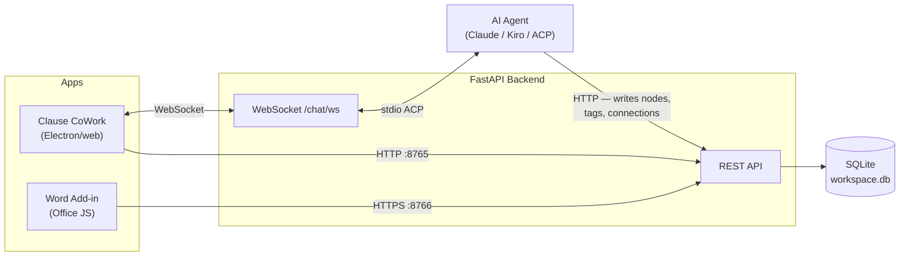

# Clause CoWork

> **Personal project.** This is an experimental tool I built to explore AI-assisted legal document analysis, vibecoded using Claude Code. It is not affiliated with any company and is not intended for production use.

Clause CoWork lets an AI agent — Claude Code, Kiro, or any [ACP](https://agentclientprotocol.org)-compatible agent — index, parse, and classify legal documents in your local workspace. Rather than building a custom agent harness, it uses the Agent Client Protocol (ACP) over WebSocket: the agent runs as a subprocess, reads your documents, and writes structured metadata directly into a local SQLite database. That database is the backend for the UI — no separate sync layer, no cloud, no document data leaving your machine (except the LLM call to your configured provider).

- **Clause CoWork** (`clause-cowork/`) — Electron/web app. Drive the agent via chat; explore the clause graph, tiles, and connections.
- **Clause CoWork Add-in** (`addin/`) — Microsoft Word task-pane add-in. Read-only viewer: tiles, graph, clause details, Word cursor sync.

For architecture details, see [ARCHITECTURE.md](ARCHITECTURE.md). For a step-by-step usage guide, see [USER_GUIDE.md](USER_GUIDE.md).

---

## Demo


### Web App

https://github.com/user-attachments/assets/7d7642c3-10c6-4ed3-9409-450a7790beb1

### Word Add-In

https://github.com/user-attachments/assets/1e835696-79e6-473d-826e-d71a85649cda

---

## Architecture



The agent is the writer — it parses documents, classifies clauses, and records connections by calling the same REST API the UI reads from. The UI is a pure reader of what the agent has written.

---

## Why ACP?

Rather than building a custom agent harness, Clause CoWork uses the [Agent Client Protocol (ACP)](https://agentclientprotocol.com/) to connect to an existing one. In essence, it is a UI wrapper around Claude Code (or Kiro, or Codex) rather than a reimplementation of capabilities the LLM providers have already built.

**Advantages:**
- Access the agent's native toolset (bash, web search, file read) without reimplementing it
- Users get the agent's built-in safety/permissions model (e.g. permission prompts before destructive actions)
- Uses the agent's existing login mechanism — typically OAuth, providing temporary credentials rather than long-term API keys
- Can leverage the agent's ability to spawn subagents, enabling parallel workstreams for larger workspaces
- Can leverage one's existing MCP, Skills, and AGENTS.md setup

**Disadvantages:**
- Less control over harness configuration — e.g. system prompts, available tools
- ACP is still relatively new and can be challenging to set up in a harness-agnostic way

---

## Document support

**Parsing (clause nodes): `.docx`, `.pdf`, `.txt`, `.md`, `.csv`** — powered by the [SuperDoc](https://superdoc.dev) SDK for `.docx`; text extraction for others.

**Preview and agent reading:** `.xlsx`, images, and other non-extractable file types are shown in the file explorer and can be read by the agent, but are tracked as stubs with no clause nodes.

---

## Prerequisites

| Requirement | Version |
|---|---|
| Python | 3.11+ |
| Node.js | 18+ |
| Microsoft Word | Desktop (Mac or Windows) — add-in only |

---

## Backend setup

### Clause CoWork (port 8765, HTTP)

```bash
cd backend
python -m venv .venv
source .venv/bin/activate        # Windows: .venv\Scripts\activate
pip install -r requirements.txt
uvicorn main:app --reload --port 8765
```

### Word add-in (port 8766, HTTPS)

Install the dev cert once:

```bash
cd addin
npm install
npx office-addin-dev-certs install
```

Then start the backend with SSL:

```bash
cd backend
source .venv/bin/activate
uvicorn main:app --reload --port 8766 \
  --ssl-keyfile ~/.office-addin-dev-certs/localhost.key \
  --ssl-certfile ~/.office-addin-dev-certs/localhost.crt
```

---

## Running Clause CoWork

```bash
cd clause-cowork
npm install
npm run dev       # Vite dev server on http://localhost:5174
```

Open `http://localhost:5174` in a browser, or `npm run electron:dev` for the desktop app.

Configure your AI agent in **Settings → Agent Server** (Claude Code, Kiro, or any ACP-compatible agent).

---

## Running the Word add-in

With the HTTPS backend (port 8766) running:

```bash
cd addin
npm run start
```

Opens Word with the add-in pre-loaded. Open a `.docx` from a workspace you've already analysed in Clause CoWork.

---

## Typical workflow

1. Open your workspace folder in **Clause CoWork**.
2. Start your ACP agent (see **Settings → Agent Server**) and connect — a session must be active before the agent can act.
3. Ask the agent to run `/index` — reads and summarises all documents, writes notes and cross-document links.
4. Ask the agent to run `/analyse` — parses clauses, classifies them, assigns doc types/tags, records connections.
5. Open a `.docx` in **Word** → the add-in displays the clause graph immediately.

For a full walkthrough see [USER_GUIDE.md](USER_GUIDE.md).

---

## LLM providers

| Agent | Command |
|---|---|
| Claude Code | `npx @agentclientprotocol/claude-agent-acp` |
| Codex | `npx @zed-industries/codex-acp` |
| Kiro | `kiro-cli acp` |

ACP adapters for Claude Code and Codex are maintained by the [Agent Client Protocol](https://agentclientprotocol.com/) project. The Codex ACP adapter is also available from [Zed Industries](https://github.com/zed-industries/codex-acp).

---

## Data storage

All workspace state lives in `.clause-cowork/` next to your documents:

```
my-workspace/
  contract.docx
  .clause-cowork/
    acp-session.json        ← per-agent session history
    db/workspace.db         ← SQLite: nodes, connections, tags, config
    notes/
      workspace.md          ← agent-maintained index
      wiki/<doc>.md         ← per-document notes
      log.md                ← timestamped index/analyse history
```

---

## Disclaimers

**Personal project.** This project was built in personal time and is wholly unconnected to my employer.

**Not legal advice.** Clause CoWork is a document analysis tool and does not provide legal advice. Nothing in this software or its outputs should be construed as legal advice. Always consult a qualified legal professional before relying on any analysis.

**AI limitations.** Clause extraction and classification are performed by large language models and may be incomplete, incorrect, or miss material provisions. Outputs should be independently verified.

**Skill tuning.** The agent skills (/index, /analyse) have not been exhaustively tested across document types and LLMs. Prompts and classification logic may need tuning for your specific use case.

**Built with Claude Code.** This personal project was developed with assistance from [Claude Code](https://claude.ai/code) by Anthropic.

**Not production-ready.** This application is designed for single-user, localhost-only use for experimental purposes only. Broader deployment requires appropriate security hardening, testing, and review before use.

**No warranty.** This software is provided as-is without warranty of any kind. Use at your own risk.

---

## Running the tests

**Backend:**

```bash
cd backend
source .venv/bin/activate
pytest tests/ -v
```

**Clause CoWork:**

```bash
cd clause-cowork
npm test
```

**Add-in:**

```bash
cd addin
npm test
```
